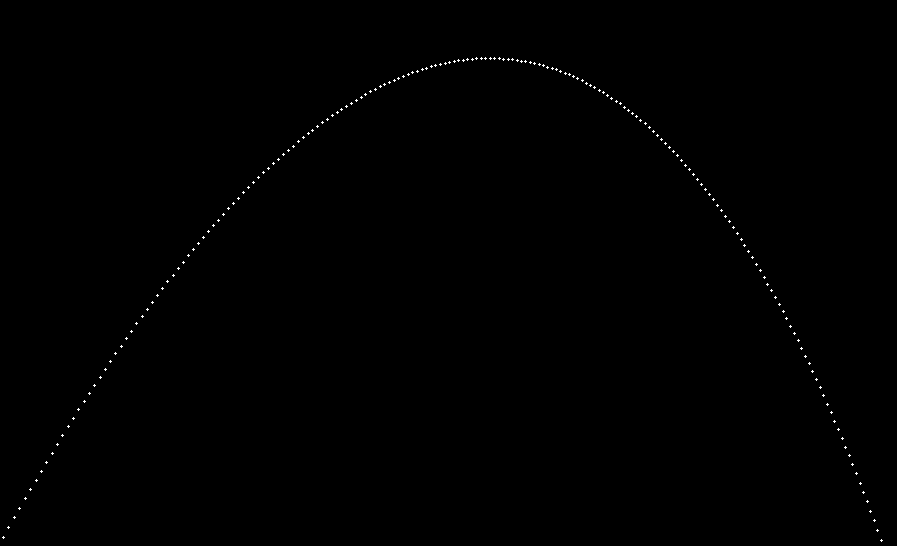
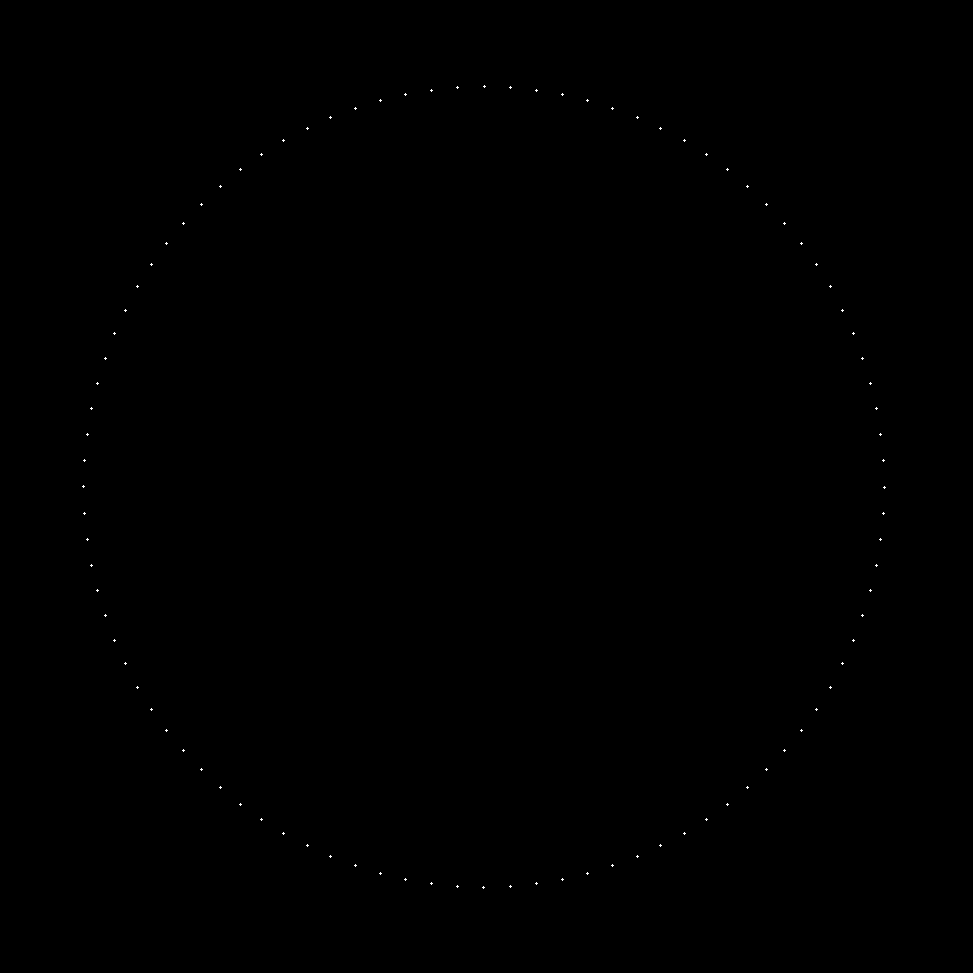
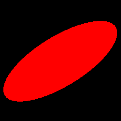

# Ray Tracer Challenge
My implementation of a ray tracer following the tests outlined in [Jamis Buck's Ray Tracer Challenge](http://raytracerchallenge.com/).

Implemented in C++ and tested with Google tests. 

### Chapter 2 Challenge: Projectile

 

### Chapter 4 Challenge: Clock

### Chapter 5 Challenge: Transformed Sphere

 
