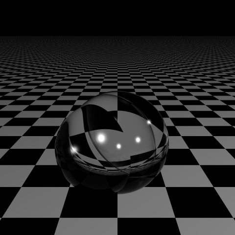
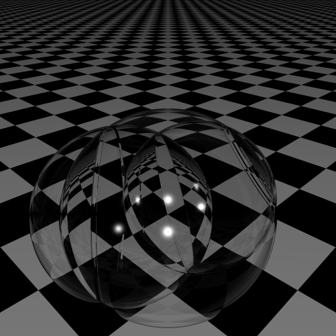
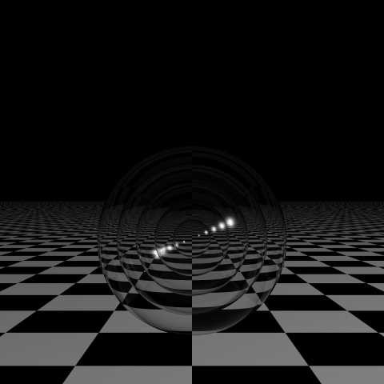
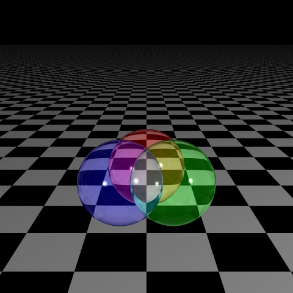
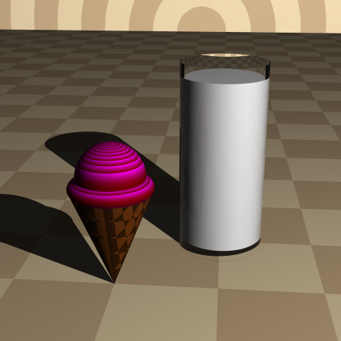

# Ray Tracer Challenge
My implementation of a ray tracer following the tests outlined in [Jamis Buck's Ray Tracer Challenge](http://raytracerchallenge.com/).

Implemented in C++ and tested with Google tests. 

### Chapter 2: Projectile

 

### Chapter 4: Clock

### Chapter 5: Transformed Sphere

 

### Chapter 6: Phong Lighting on Sphere 

 

### Chapter 7: Making A Scene

 
 

### Chapter 8: Shadows

 
 

### Chapter 9: Planes
 
 
 

### Chapter 10: Patterns

[//]: # (  )

[//]: # (  )
 

### Chapter 11: Reflection & Refraction 
  
  

### Chapter 12 & 13: Cylinders & Cones
 

